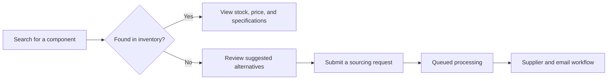

# SadeepaElectronics IC Marketplace


> A modern, AI-assisted marketplace for searching, comparing, and sourcing integrated circuits and other electronic components.

SadeepaElectronics helps engineers, hardware teams, and procurement professionals find electronic components quickly. Users can search live inventory by part number, manufacturer, or description, review technical specifications and availability, and submit a sourcing request when a required component is unavailable.

## Features

- Real-time component search powered by Laravel Livewire
- Search by part number, manufacturer, or product description
- Inventory status, available quantity, pricing, lead time, and package details
- Technical data including voltage range, temperature range, compliance, and datasheet links
- AI-assisted suggestions for compatible or alternative components
- Sourcing request form for unavailable and hard-to-find parts
- Unique sourcing reference numbers for request tracking
- Form validation, duplicate-request protection, and IP-based rate limiting
- Queued request processing and email-notification workflow
- Responsive, dark-themed interface built with Tailwind CSS

## How It Works



## Technology Stack

| Area | Technology |
| --- | --- |
| Backend | PHP 8.2+, Laravel 12 |
| Interactive UI | Livewire 4, Alpine.js |
| Styling | Tailwind CSS 4 |
| Frontend tooling | Vite 7 |
| Database | SQLite by default; Laravel also supports MySQL and PostgreSQL |
| Background work | Laravel database queues |
| AI integration | Anthropic Messages API |
| Testing | PHPUnit 11 |

## Getting Started

### Prerequisites

Install the following before running the project:

- PHP 8.2 or newer
- Composer
- Node.js and npm
- SQLite, MySQL, or PostgreSQL

### Installation

1. Clone the repository and enter the project directory:

   ```bash
   git clone https://github.com/sadeepaghost/IC-Marketplace-.git
   cd ic-marketplace
   ```

2. Install the PHP and JavaScript dependencies:

   ```bash
   composer install
   npm install
   ```

3. Create the environment file and application key:

   ```bash
   cp .env.example .env
   php artisan key:generate
   ```

   On Windows PowerShell, use `Copy-Item .env.example .env` instead of `cp`.

4. Create the default SQLite database:

   ```bash
   touch database/database.sqlite
   ```

   On Windows PowerShell, use `New-Item database/database.sqlite -ItemType File`.

5. Run the database migrations:

   ```bash
   php artisan migrate
   ```

6. Start the application:

   ```bash
   composer run dev
   ```

The application will be available at [http://localhost:8000](http://localhost:8000).

## Configuration

The default configuration uses SQLite, database-backed sessions, caching, and queues. Update `.env` if you want to use a different database or mail provider.

For AI-assisted alternative-part suggestions, configure an Anthropic API key through Laravel's service configuration. For sourcing notifications, configure a mail provider and the marketplace administrator email. Never commit API keys, passwords, or a populated `.env` file.

After changing environment values, clear the cached configuration:

```bash
php artisan config:clear
```

## Useful Commands

```bash
# Start the web server, queue worker, log viewer, and Vite
composer run dev

# Build production frontend assets
npm run build

# Process sourcing requests manually
php artisan queue:work --queue=sourcing

# Run the automated test suite
composer test

# Format PHP code
./vendor/bin/pint
```

## Project Structure

```text
app/
├── Jobs/                 # Background sourcing-request processing
├── Livewire/             # Interactive component search and request form
├── Mail/                 # Email notifications
├── Models/               # Product and sourcing-request models
└── Services/             # Alternative-part suggestion integration
database/
├── migrations/           # Products, sourcing requests, queues, and users
└── seeders/              # Local development data
resources/
├── css/                  # Tailwind styles
├── js/                   # Frontend entry points
└── views/                # Blade and Livewire views
routes/                   # Application routes
tests/                    # Unit and feature tests
```

## Current Status

This project is under active development. Inventory search and sourcing-request capture are implemented. Before a production deployment, complete and verify the AI credentials, outgoing mail workflow, production inventory import, tests, and security settings.

## Contributing

Contributions and suggestions are welcome. Fork the repository, create a focused branch, make your changes, and open a pull request with a clear description of the improvement.

## Author

Developed by **Sadeepa Amaranayake** as an electronic-component sourcing and marketplace project.